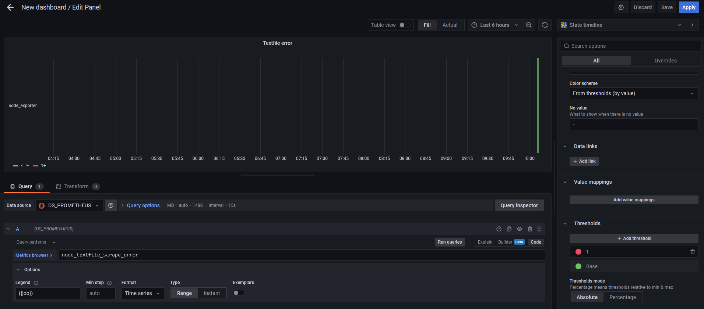
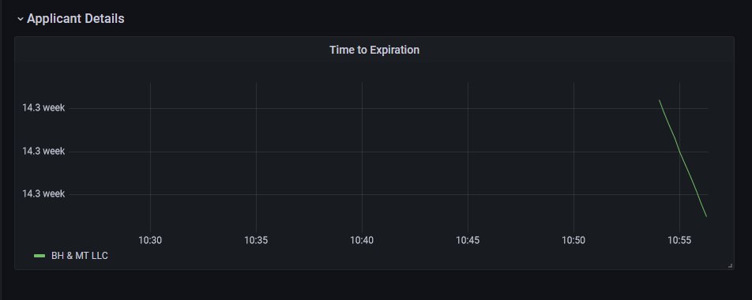

# Journal

# 8:30

I use the pwsh shell in my makefile to make it cross platform :-)
```
ifeq ($(OS),Windows_NT)
	SHELL := pwsh.exe
else
	SHELL := pwsh
endif

.SHELLFLAGS := -NoProfile -Command
```

We build the docker images, and compose them up. You can see the node_exporter metrics at `http://localhost:9100/metrics`

`Invoke-WebRequest -Uri http://localhost:9100/metrics | select -ExpandProperty RawContent`


Access Grafana at: http://localhost:3000/login (admin,admin)

Prometheus at: http://localhost:9090/targets?search=

# 9:00

Start the pwsh script. I want to setup a test framework quick so I can use that as a baseline for all my development. The `Get-ETLConfig.ps1` is a abstraction to make it very easy to codify and the confirm proper environment settings via testing. 

# 9:30

Pwsh testing is working well, working on the etl portion of this. Started the docker image that the pwsh will run in. 

I used a private image `bmcclure89/fc_powershell:main` for the pwsh due to it's availability to me. For a team/production setting this would be a private base image. 

# 10:00 

We need to test that the textfile is not having any issues, this [graph link](http://localhost:9090/graph?g0.expr=node_textfile_scrape_error&g0.tab=1&g0.stacked=0&g0.show_exemplars=0&g0.range_input=1h) should show you. 

I would like to document the Prometheus relabels and labeling strategy more. 

Create a dashboard. new state viz to show that the text file is working
  

also added a viz to show the time since the last run via expresison: `time() - max(data_data_instance_last_complete_epoch_seconds_diff) by(script_name)`

You need gitlfs now because I added images. If I had more time I would add actions/make target to test if the files actually are lfs. 

# 10:30

Powershell to metrics

banged my ahead against a prometheus file issue. A tab snuck in. Implemented `prom_lint` target to warn me before I deploy. 

Updated the grafana dashboard with some viz with expression: `min(location_expiration_epoch{Applicant=~"$Applicant"}) by (Applicant) - time()`

There is also a variable to let us pick our favorite food trucks to show us when their permit expires. 
  

There is not alot of discrepancy in this expiration data. This data will become more rich as we run the job over time, and collect the changeing data/metrics. 

Next steps. I would love to stand up a RDS instance on AWS via terraform and load this data into that for persistence outside of prometheus. That is not doable in 30 minutes, so I will instead setup AWS ECR registries for the docker images. (And github build actions for the whole thing?)

# 11:00

# Done