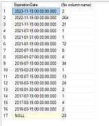
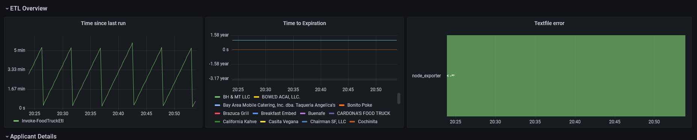
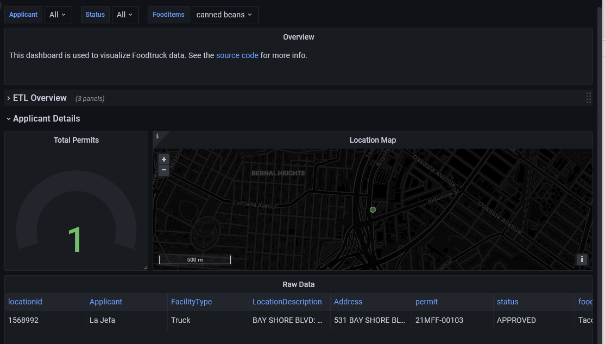
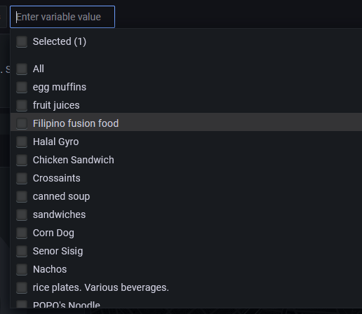

---
title:
- San Francisco Foodtruck permits
author:
- Brandon McClure
theme:
- Berkeley
fontsize: 10pt
---

# Source

Source data can be found [here](https://github.com/brandonmcclure/foodtrucks). Source code for processing the data can be found [here](https://data.sfgov.org/Economy-and-Community/Mobile-Food-Facility-Permit/rqzj-sfat/data).

## User Story

As a connoisseur of food trucks, I would like to ensure that there are enough food trucks of a specific type in a close enough location so that I can actively petition/deploy new trucks when needed.

# Initial Analysis

Data was loaded into MS SQL server (as raw data), and then prometheus for operational metrics (How frequently the job runs, as well as time stamps for when the permits expire.) All data is surfaced via Grafana

The operational data for expiration is not very useful, as most permits expire on 11/15 of each year.

  

```sql
select cast(ExpirationDate as datetime) as [ExpirationDate], count(*)
from dbo.mostrecent_raw
group by cast(ExpirationDate as datetime)
order by cast(ExpirationDate as datetime) desc
```

# Operational data

  

The job is running every 5 minutes, and I can drill into specific applicants to see when their permits expire.

# Food Items

The data we receive contains a `:` delimited list of the food items that a given permit holder sells. I used the sql `string_split` table function to create a grafana variable to allow users to filter.

This opens up some interesting potential analysis, but also data cleaning issues.

The data should be structured differently in SQL to make searching more performant and consistent. 

# Canned beans

Lets head to 531 Bay Shore Blvd for some Canned beans!

  

# Other food items

  

